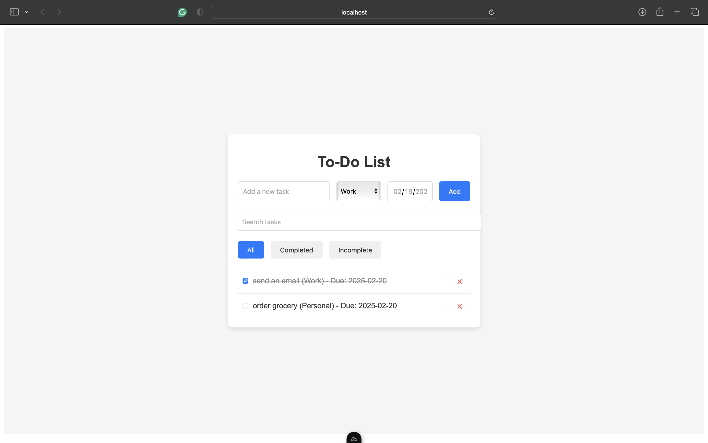

# To-Do App with Nuxt.js

A simple and elegant To-Do app built using **Nuxt.js**. This single-page application (SPA) allows users to manage their tasks with features like task completion, categories, due dates, filtering, and search.

 

---

## Features

- **Add Tasks**: Add new tasks with a description, category, and due date.
- **Task Completion**: Mark tasks as completed with a checkbox.
- **Task Categories**: Categorize tasks as Work, Personal, or Shopping.
- **Due Dates**: Set due dates for tasks.
- **Task Filtering**: Filter tasks by "All", "Completed", or "Incomplete".
- **Task Search**: Search for tasks by their description.


---

## Technologies Used

- **Nuxt.js**: A Vue.js framework for building modern web applications.


---

## Setup Instructions

### Prerequisites

- **Node.js**: Make sure you have Node.js installed on your machine. Download it from [here](https://nodejs.org/).
- **npm**: npm is included with Node.js.

### Installation

1. Clone the repository:
   ```bash
   git clone https://github.com/KruthiNagabhushan/Web-App-using-NuxtJS-and-VUEX.git
   ```
2. Navigate to the project directory:
   ```bash
   cd todo-app
   ```
3. Install dependencies:
    ```bash
    npm install
    ```
4. Start the development server:
    ```
    npm run dev
    ```
5. Open your browser and visit:
    ```bash
    http://localhost:3000
    ```

## Usage
1. Add a Task:

    - Enter a task description in the input field.

    - Select a category (Work, Personal, Shopping).

    - Set a due date (optional).

    - Click "Add" or press Enter.

2. Mark a Task as Completed:

    - Check the checkbox next to the task.

3. Filter Tasks:

    - Use the filter buttons to view "All", "Completed", or "Incomplete" tasks.

4. Search for Tasks:

    - Use the search bar to find tasks by their description.

5. Remove a Task:

    - Click the × button next to the task to remove it.